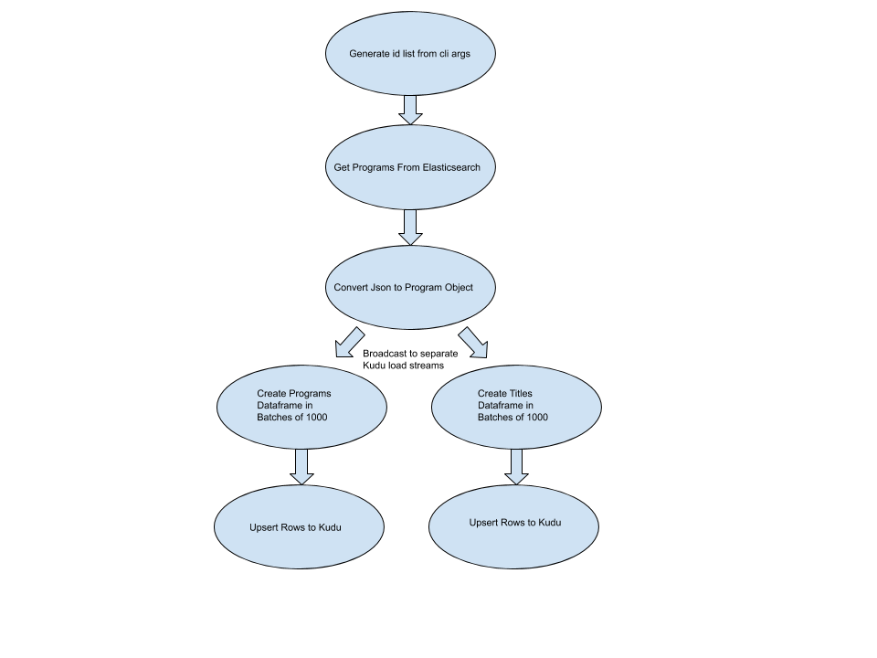

## Overview
This application is developed as a cli app, which will eventually be a service to load program data from 
elasticsearch to kudu using scala, akka, akka streams, and spark.

* https://www.elastic.co/
* https://kudu.apache.org/
* https://spark.apache.org/
* https://akka.io/

### Data Model
The data model is a simplified version of programs that users would watch on tv, in theaters, or on the internet.

[Program Object](src/main/scala/com/gracenote/cae/sparkkuduload/program) has more details

Note all sample data loaded into elasticsearch has been significantly simplified.  Only 100 programs are seeded and only some of the basic program fields and titles are populated.

[Seed Data](src/main/resources/programs.json) can be viewed.

### Data Flow
1. Create program id list - Either a list of ids (--ids) or a range (--min,--max) from cli argument
2. Get Program Json from Elasticsearch
3. Convert Json into Program object
4. Broadcast Program to Seperate Streams for upserting
5. Create Dataframes in batches of 1000
6. Upsert to Kudu

### Developer Environment
The following instructions are specific to Linux systems other OS's may vary slightly.

The following software is required
* docker
* docker-compose

Note - if you want to mount the host computers dependencies uncomment the mounts in docker-compose.yml.

Add the following exports to your .profile or .bashrc and open a new shell.
    
    export UID # Used to prevent user permission conflicts between shared volumes
    # KUDU_QUICKSTART_IP is used to pass kudu an ip resolvable from all servers
    export KUDU_QUICKSTART_IP=$(ifconfig | grep "inet " | grep -Fv 127.0.0.1 |  awk '{print $2}' | tail -1)
    
Clone and build the stack using docker-compose.  There are a bunch of deps so it will take a while.    

    git clone https://github.com/erikmiller/udacity_project5.git
    cd udacity_project5
    docker-compose up -d   # This should build the entire stack, and run it in the background
    
You should now have the following accessible via a web browser from your host.

    Elasticsearch - localhost:9200
        http://localhost:9200/programs/_search should display an error since it's not initialized yet
    Kudu - tablet servers - localhost:<8050,8150,8250> 
           master servers - localhost:<8051,8151,8251>
        http://localhost:8051/tables should display a link to the leaders tables page which displays no tables.
    
Now we can log into our app container to finalize set up and start loading data.
the process logs us into a bash shell inside our container which we can then use to build the project and perform
operations against the cluster.

    docker-compose run app      # This will log into the app container, you can interact with the app using standard bash
    sbt pack                    # generates a `pack` located in target/pack
    target/pack/bin/main usage  # display usage of the app
    target/pack/bin/main init-stack # we can now see seed data in es and empty tables in kudu
    
    # Load some data - Note ids 1-100 exist in elasticsearch.
    target/pack/bin/main load -t programs -s elasticsearch --ids "1,2,3" 
    target/pack/bin/main load -t programs -s elasticsearch --min 1 --max 100
    
    # Query some data - This displays a up to 100 rows of a data frame.
    target/pack/bin/main kudu --sql "SELECT * FROM programs p INNER JOIN titles t ON p.program_id = t.program_id"
    
#### Common Command
Some commands used for developing and testing the application.

    sbt compile
    sbt run - Executes the main class define in sbt.build
    sbt console - Start sbt interactive shell then type console for a repl with deps loaded
    sbt test - Run the entire test quite
    sbt test-only com.gracenote.cae.sparkkuduload.Program
    
    